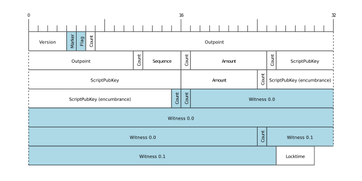
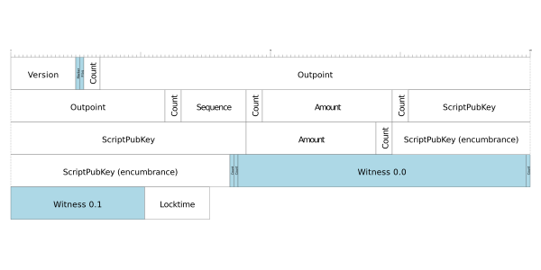

# Segregated Witness (SegWit) Transactions

Segregated Witness (SegWit) is an upgrade to the Bitcoin protocol that separates the witness data (signatures) from the transaction data. This allows for more efficient use of block space and enables new features such as the Lightning Network. SegWit transactions have a different structure compared to traditional transactions, and their size and weight are calculated differently.

Given a transaction with one input (using P2WPKH) and two P2WPKH outputs, the segwit equivalent to the P2PKH transaction would be have the following byte map template with the segwit-specific fields highlighted in blue: 

To change from bytes to weight units, we use the method described above where the highlighted fields stay the same size but the other fields are multiplied by four. When displayed at the same scale, this makes it appear that the segwit fields have shrunk: 

At 561 weight units, to include the above transaction in a block consumes 0.014025% of the available maximum block space, a 61% reduction compared to the equivalent legacy transaction described previously. The exact amount of space saved by converting from legacy transactions to segwit transactions will vary depending on various transaction details.

# Bitcoin Transaction Size and Weight

The size of a transaction in bytes mostly depends on how many inputs and outputs are in the transaction. Here are the average sizes for typical transactions (with P2WPKH locking scripts on the outputs):

- Inputs: 1, Outputs: 1 = 141 bytes
- Inputs: 1, Outputs: 2 = 174 bytes (most common)
- Inputs: 2, Outputs: 1 = 252 bytes
- Inputs: 2, Outputs: 2 = 285 bytes (very common)
- ...so on and so forth.

The more inputs and outputs there are in a transaction, the bigger it gets. There is no limit to how big a transaction can be in terms of bytes, other than the fact that it needs to be able to fit inside a block. Every transaction has a weight measurement. This measurement was introduced in the segregated witness upgrade. A transaction's weight is calculated by multiplying the size (in bytes) of different parts of the transaction by either 4 or 1.

Let's take the example of a typical SegWit transaction : `02000000000101bcee9cbb06068c7fcc1509ad4d7741a1d529cbd132cb873fbb73b765804e7ff00300000000fdffffff02c05c150000000000160014c3505ec85064f4d20382eb864edd42f3ea39aabdb571500000000001600148bab88136e7a2eedfebdc7fff4eae9b0bc1b015502473044022044c6658dff39c43a4ed1ae9a4bdaaf4bfad05efa0a36ad6df2a9cdba1c89f5400220702c5eb91cdb5c96d27e156aa1dc06196e6ba8b597508f1819dd048be8140bb4012103cb87f4e04499f40417b58b6e57e90a442651d46c942a1a6a0f186a1ccfe63d4700000000`

Since Segwit upgrade, transaction sizes are expressed in weight units(WU)
4 weight unit (WU) = 1 virtual bytes(vB)
Virtual size (vB) is used to express the fee rate of a transaction.
Each non-segwit byte of data is counted as 4 WU
Segwit data are counted as 1 byte = 1 WU

Here is a detailed breakdown of the aforementioned SegWit transaction:

| **Field**                     | **Value**                      | **Bytes** | **Type (multiplier)** | **WU (Weight Units)** |
|-------------------------------|--------------------------------|-----------|-----------------------|------------------------|
| **Version**                   | `02000000`                    | 4         | Non-witness (x4)      | 16                     |
| **Segwit Marker**             | `0001`                        | 2         | Witness (x1)          | 2                      |
| **Number of Inputs**          | `01`                          | 1         | Non-witness (x4)      | 4                      |
| **TXID_1**                    | `bcee....7ff0`                | 32        | Non-witness (x4)      | 128                    |
| **Vout**                      | `03000000`                    | 4         | Non-witness (x4)      | 16                     |
| **ScriptSig's Length**        | `00`                          | 1         | Non-witness (x4)      | 4                      |
| **ScriptSig**                 | `0`                           | 0         | Non-witness (x4)      | 0                      |
| **Sequence**                  | `fdffffff`                    | 4         | Non-witness (x4)      | 16                     |
| **Number of Outputs**         | `02`                          | 1         | Non-witness (x4)      | 4                      |
| **Output's Value (1)**        | `c05...00`                    | 8         | Non-witness (x4)      | 32                     |
| **ScriptPubkey's Length (1)** | `16`                          | 1         | Non-witness (x4)      | 4                      |
| **ScriptPubkey (1)**          | `0014...9aab`                 | 22        | Non-witness (x4)      | 88                     |
| **Output's Value (2)**        | `db57150000000000`            | 8         | Non-witness (x4)      | 32                     |
| **ScriptPubkey's Length (2)** | `19`                          | 1         | Non-witness (x4)      | 4                      |
| **ScriptPubkey (2)**          | `00148...b0155`               | 22        | Non-witness (x4)      | 88                     |
| **Number of Witness**         | `02`                          | 1         | Witness (x1)          | 1                      |
| **Witness 1 Length**          | `47`                          | 1         | Witness (x1)          | 1                      |
| **Witness 1**                 | `30440..401`                  | 71        | Witness (x1)          | 71                     |
| **Witness 2 Length**          | `21`                          | 1         | Witness (x1)          | 1                      |
| **Witness 2**                 | `03cb....3d47`                | 33        | Witness (x1)          | 33                     |
| **LockTime**                  | `00000000`                    | 4         | Non-witness (x4)      | 16                     |
| **Total**                     |                                | **222**   |                       | **561**                |

# References 

- https://github.com/bitcoin/bips/blob/master/bip-0141.mediawiki#transaction-size-calculations 
- https://en.bitcoin.it/wiki/Weight_units 
- https://bitcoin.stackexchange.com/questions/121269/what-is-arbitrary-witness-data-and-unspent-transaction-output 
- https://learnmeabitcoin.com/technical/transaction/size/ 